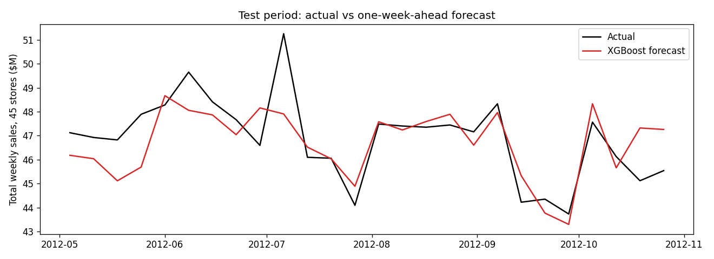
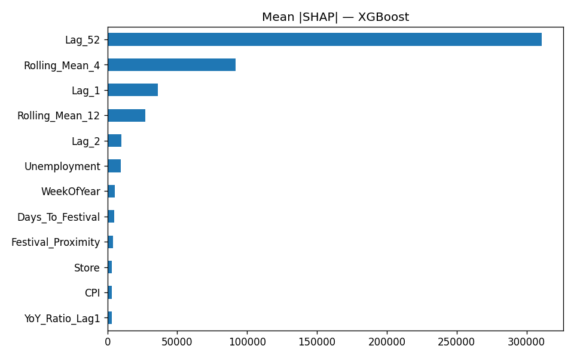

# Retail Demand Forecasting with Festival and Social Media Trend Integration

## Problem Statement

Retail demand forecasting is a critical task for inventory management, supply chain optimization, and sales planning. Traditional forecasting approaches primarily rely on historical sales data and often fail to capture the influence of external factors such as festivals and social media trends.

This project aims to improve forecasting accuracy by integrating festival effects and simulated social media indicators into the prediction process.

---

## Objectives

* Forecast future retail demand using machine learning.
* Analyze the impact of festivals on sales performance.
* Simulate social media trend indicators and study their relationship with demand.
* Compare multiple machine learning models.
* Explain model predictions using SHAP.
* Develop an interactive Streamlit dashboard.

---

## Dataset

Primary Dataset: Walmart Store Sales Dataset

Features include:

* Store
* Date
* Weekly Sales
* Holiday Flag
* Temperature
* Fuel Price
* CPI
* Unemployment

Additional engineered features:

* Festival Features
* Social Media Trend Features
* Lag Features
* Rolling Statistics
* Interaction Features

---

## Workflow

Data Collection
      ↓
Data Cleaning & Preprocessing
      ↓
EDA (Sales patterns, trends)
      ↓
Festival Feature Engineering
      ↓
Social Media Trend Simulation
      ↓
Feature Engineering (lags, rolling, interactions)
      ↓
Model Training (XGBoost, RF, LightGBM)
      ↓
Model Evaluation (RMSE, MAE, R²)
      ↓
SHAP Explainability
      ↓
Forecast Generation
      ↓
Streamlit Dashboard

---

## Architecture

Dataset → Preprocessing → Feature Engineering → Model → Forecast → Dashboard

---

## Methodology

### Phase 1: Data Understanding

* Data Loading
* Missing Value Analysis
* Duplicate Detection
* Outlier Detection
* Exploratory Data Analysis

### Phase 2: Festival Feature Engineering

Created:

* Festival Flag
* Festival Name
* Festival Score
* Days To Festival
* Festival Impact Score

Festivals included (US retail calendar, since Walmart's data comes from US stores):

* Super Bowl · Valentine's Day · Easter · Memorial Day · Independence Day
* Back to School · Labor Day · Halloween · Thanksgiving · Black Friday
* Christmas · New Year

### Phase 3: Social Media Trend Simulation

No real social-media data exists for these 2010–2012 stores, so **Trend Score, Mention Count and Sentiment Score are simulated** from the festival calendar plus store-level and week-to-week noise. They are generated **without using sales**, and the model only sees **last week's** values, as it would with a real feed. The pipeline is built so a real signal (e.g. Google Trends) can replace the simulation.

### Phase 4: Advanced Feature Engineering

Created:

* Year
* Month
* Week
* Quarter
* Day
* DayOfWeek
* WeekendFlag

Lag Features:

* Lag_1
* Lag_4
* Lag_12

Rolling Features:

* Rolling Mean
* Rolling Standard Deviation
* Moving Average

Interaction Features:

* Festival × Trend
* Festival × Sentiment
* Trend × Engagement

### Phase 5: Model Development

Models Trained:

1. Random Forest Regressor
2. XGBoost Regressor
3. LightGBM Regressor

### Phase 6: Evaluation

Metrics Used:

* MAE
* RMSE
* MAPE
* R² Score

### Phase 7: Explainable AI

Used SHAP to explain:

* Festival Impact
* Trend Impact
* Sentiment Impact
* Feature Importance

### Phase 8: Forecasting

One-week-ahead forecasts for each store over the 26-week test period (`outputs/predictions.csv`), plus the all-store weekly total (`outputs/forecast_results.csv`).

### Phase 9: Streamlit Dashboard

Features:

* Dataset Overview
* Sales Trend Analysis
* Festival Analytics
* Social Media Analytics
* Demand Forecasting
* SHAP Explainability
* CSV Download

---

## Model Performance (v2, leak-free)

**Setup:** one-week-ahead forecast of `Weekly_Sales` for all 45 stores. Train Feb 2011 – Apr 2012; **test on the last 26 weeks (May – Oct 2012)** for every store. Every feature uses only information available before the forecast week.

| Model | MAE ($) | RMSE ($) | WMAPE | R² |
|---|---|---|---|---|
| Naive (last week's sales) | 50,865 | 76,053 | 4.88% | 0.980 |
| Seasonal naive (same week last year) | 54,031 | 81,786 | 5.19% | 0.977 |
| Random Forest | 37,999 | 60,244 | 3.65% | 0.987 |
| LightGBM | 39,711 | 60,610 | 3.81% | 0.987 |
| **XGBoost** | **37,363** | **56,487** | **3.59%** | **0.989** |

XGBoost cuts the error of the naive forecast by **27%**.

**What do festival and social features add?** (XGBoost, same settings)

| Features | MAE ($) | WMAPE |
|---|---|---|
| Base: sales history + calendar + economy | 38,510 | 3.70% |
| + Festival features | 38,191 | 3.67% |
| + Festival + simulated social | 37,363 | 3.59% |

- Festival features give a small, consistent gain (≈1% overall, 1.3% on festival and pre-festival weeks). The test window (May–Oct) contains no Thanksgiving or Christmas, so the biggest festival effects cannot show up here.
- The simulated social features are built from the festival calendar, so any gain from them is **not evidence about real social media** — testing that needs real data.

## v2: fixing data leakage

The first version reported R² = 0.997 and MAPE = 1.8%. Reviewing it showed the score came from **target leakage**, not forecasting skill:

1. **Simulated social features were computed from the same week's sales** (`Trend_Score = scaled Weekly_Sales × 40 + …`), so the model was given the answer. They are now generated from the calendar only and lagged by one week.
2. **Rolling means included the current week** (`rolling(4).mean()` without `shift`); `Rolling_Mean_4` was the top SHAP feature. All history features now use `shift(1)` first.
3. **Store averages and growth rates used current and future sales.** Removed.
4. **The train/test split was by store, not by time** (stores 1–36 vs 37–45 over the same weeks). The test set is now the final 26 weeks for every store.
5. **Indian festivals were applied to US stores.** Replaced with the US retail calendar.
6. Naive and seasonal-naive **baselines** were added so every score has a reference point.

`src/*.ipynb` contain the original exploratory analysis (v1); `pipeline/forecast_pipeline.py` is the leak-free v2 pipeline that produces all reported results.

## Technologies Used

* Python
* Pandas
* NumPy
* Matplotlib
* Seaborn
* Scikit-learn
* XGBoost
* LightGBM
* SHAP
* Streamlit

---

## How to Run the Project

Follow the steps below to run the project locally on your system:

### Step 1: Clone the Repository

git clone https://github.com/Ananya2029/Retail-Demand-Forecasting-with-Festival-and-Social-Media-Trend-Integration.git

### Step 2: Navigate to Project Folder

cd Retail-Demand-Forecasting-with-Festival-and-Social-Media-Trend-Integration

### Step 3: Create Virtual Environment

python -m venv venv

Activate it:

**Windows:**

venv\Scripts\activate

**Mac/Linux:**

source venv/bin/activate

### Step 4: Install Dependencies

pip install -r requirements.txt

### Step 5: Run the forecasting pipeline

python pipeline/forecast_pipeline.py

### Step 6: Run Jupyter Notebooks (Optional)

To explore data preprocessing and model training:

jupyter notebook

Then open files inside the src/ folder.

### Step 7: Run Streamlit Dashboard

streamlit run dashboard/app.py

### Step 8: View Output

After running Streamlit, open the link shown in terminal:

http://localhost:8501

You will see:

* Sales trends
* Festival analysis
* Social media impact
* Forecast predictions
* SHAP explainability dashboard

---

## Future Scope

* Real-time social media integration using APIs.
* Real-time festival and event calendars.
* Deep learning forecasting models.
* Cloud deployment.
* Multi-store inventory optimization.

---

## Conclusion

A leak-free XGBoost model forecasts next week's sales for 45 Walmart stores with a 3.6% weighted error, 27% better than the naive baseline. Calendar-based festival features help modestly on the May–October test period. Whether social-media trends improve forecasts remains an open question that needs real social data — the pipeline is ready to plug it in.
